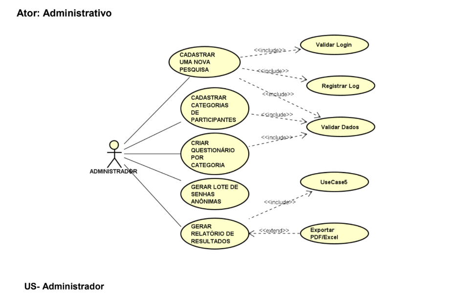
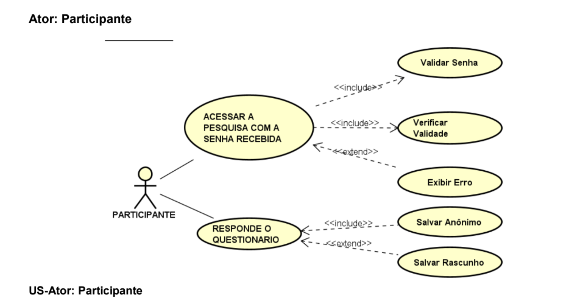
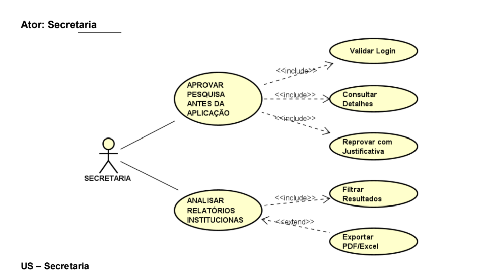
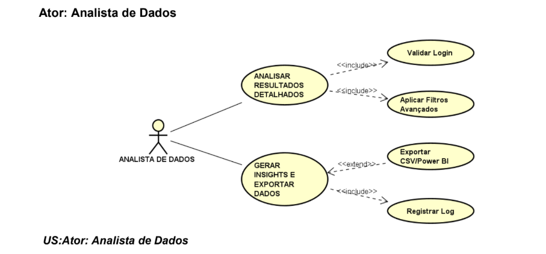
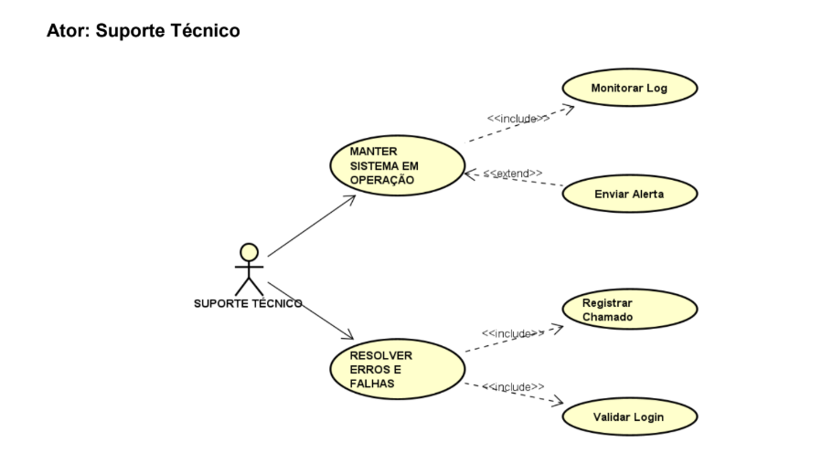
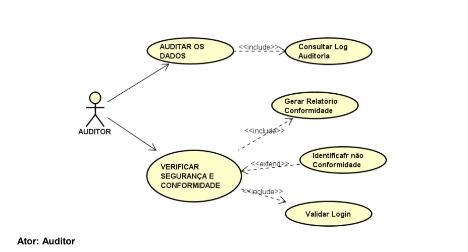

# Diagramas de Casos de Uso

Este documento reúne os diagramas de casos de uso do Sistema Web para Gestão de Pesquisas por Questionários, organizados por módulo funcional. Cada diagrama representa as interações entre os atores e as funcionalidades correspondentes aos Requisitos Funcionais (RF) do sistema.

---

## 1. Módulo de Cadastro de Pesquisa

**Requisitos relacionados:** RF01, RF02
**Ator principal:** Administrador

Representa o cadastro de pesquisas (título, descrição, período, status) e o cadastro das categorias de participantes associadas a cada pesquisa.

---

## 2. Módulo de Questionários

**Requisitos relacionados:** RF03, RF04
**Ator principal:** Administrador

Representa a criação de questionários por categoria de participante, incluindo o cadastro de perguntas e alternativas de resposta.

---

## 3. Módulo de Geração de Senhas

**Requisitos relacionados:** RF05, RF06
**Ator principal:** Administrador

Representa a geração de senhas anônimas em lote por categoria e a exportação das senhas geradas em PDF ou CSV.

---

## 4. Módulo de Aplicação da Pesquisa (Coleta de Dados)

**Requisitos relacionados:** RF07, RF08, RF09
**Ator principal:** Participante

Representa o acesso do participante via senha anônima, a exibição do questionário correspondente à sua categoria, o registro das respostas no banco de dados e o bloqueio de reutilização da senha.

---

## 5. Módulo de Gestão (Dashboard)

**Requisitos relacionados:** RF10
**Atores principais:** Administrador, Secretaria, Analista de Dados

Representa o monitoramento da participação em tempo real, com indicadores de senhas geradas, respostas recebidas, taxa de participação e participação por categoria.

---

## 6. Módulo de Relatórios

**Requisitos relacionados:** RF11, RF12
**Atores principais:** Analista de Dados, Secretaria, Administrador

Representa a geração de relatórios estatísticos (por pergunta, por categoria e comparativos entre categorias) e a exportação dos resultados em PDF ou CSV.

---

## Rastreabilidade (Diagrama x Requisitos Funcionais)

| Diagrama | Módulo | Requisitos Funcionais |
|----------|--------|------------------------|
| caso-de-uso-01.png | Cadastro de Pesquisa | RF01, RF02 |
| caso-de-uso-02.png | Questionários | RF03, RF04 |
| caso-de-uso-03.png | Geração de Senhas | RF05, RF06 |
| caso-de-uso-04.png | Aplicação da Pesquisa | RF07, RF08, RF09 |
| caso-de-uso-05.png | Dashboard de Gestão | RF10 |
| caso-de-uso-06.png | Relatórios | RF11, RF12 |